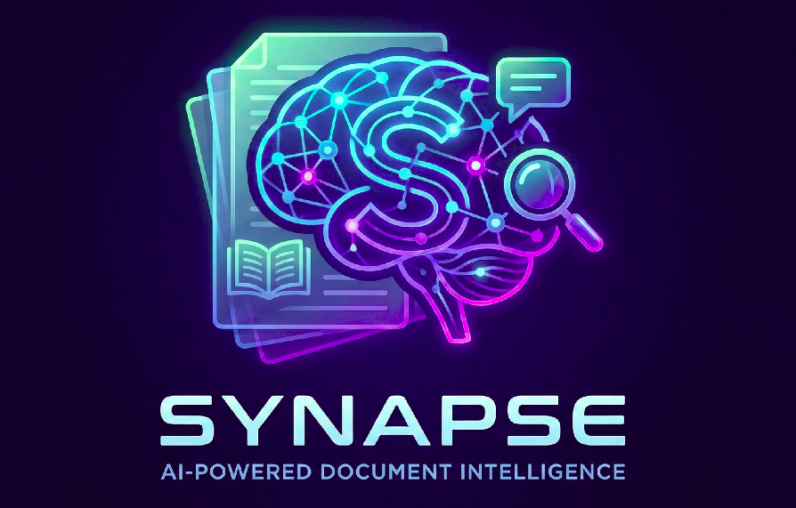

<div style="text-align: center;">
<p style="font-size: 2em; font-weight: bold;">Synapse</p>

</div>
<br>
<br>

Synapse is a RAG-based AI PDF viewer with a built-in chatbot, making it easier than ever to search, analyze, and learn from your documents.

## Features

- RAG-based AI PDF viewer
- Built-in chatbot
- Search, analyze, and learn from your documents

## Download the latest release from [Releases](https://github.com/venkatmidhunmareedu/synapse/releases)

## Project Setup

### Install

```bash
$ pnpm install
```

### Development

```bash
$ pnpm dev
```

### Build

```bash
# For windows
$ pnpm build:win

# For macOS
$ pnpm build:mac

# For Linux
$ pnpm build:linux
```
