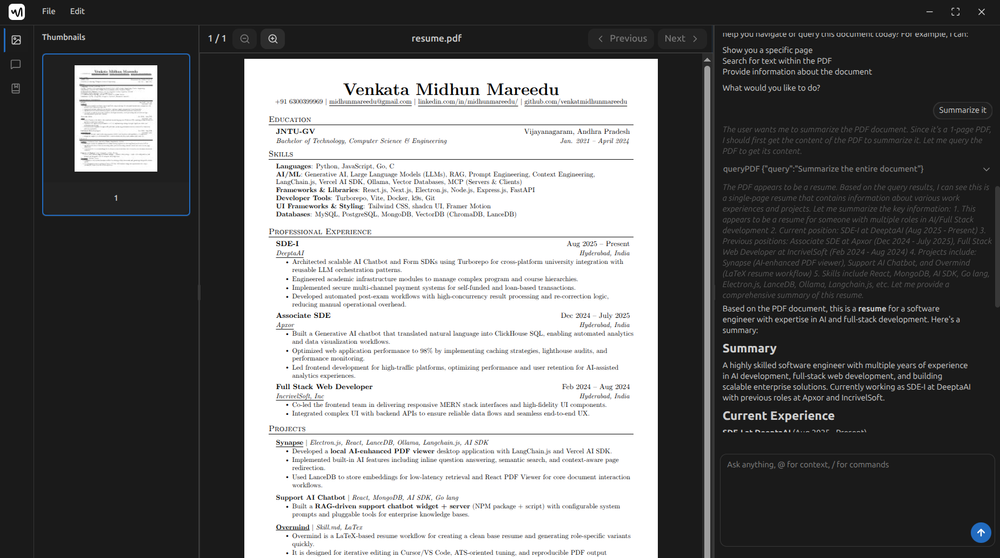

# Synapse

 
  
Synapse is a RAG-based AI PDF viewer with a built-in chatbot, making it easier than ever to search, analyze, and learn from your documents.

## Features

- RAG-based AI PDF viewer
- Built-in chatbot
- Search, analyze, and learn from your documents

## Download the latest release from [Releases](https://github.com/venkatmidhunmareedu/synapse/releases)

## Project Setup

### Install

```bash
$ pnpm install
```

### Linux note (Electron sandbox)

If you see a `chrome-sandbox` SUID error while running `pnpm dev`, fix the Electron sandbox binary permissions:

```bash
sudo chown root:root "$(echo node_modules/.pnpm/electron@*/node_modules/electron/dist/chrome-sandbox)"
sudo chmod 4755 "$(echo node_modules/.pnpm/electron@*/node_modules/electron/dist/chrome-sandbox)"
```

This can happen again after reinstalling dependencies or upgrading Electron.

### Development

```bash
$ pnpm dev
```

### Build

```bash
# For windows
$ pnpm build:win

# For macOS
$ pnpm build:mac

# For Linux
$ pnpm build:linux
```

